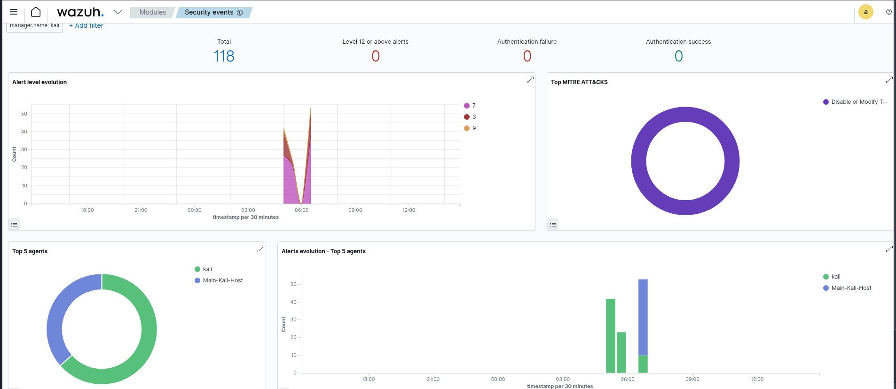
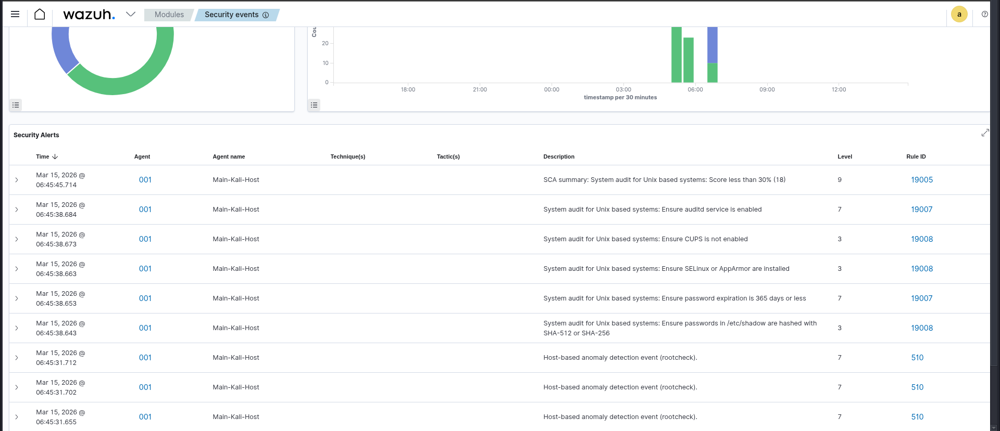

# SOC Automation & Security Monitoring with Wazuh SIEM

## Objective
The goal of this project was to deploy a fully functional **Wazuh SIEM (Security Information and Event Management)** environment to monitor endpoint security, analyze logs in real-time, and detect potential threats using integrated **MITRE ATT&CK** mapping.

### 

---

## Skills Cultivated
* **SIEM Architecture:** Deployment and configuration of Wazuh Manager and Indexer.
* **Endpoint Monitoring:** Deploying and managing agents on Linux/Unix systems.
* **Log Analysis:** Interpreting system logs to identify malicious activity.
* **Threat Detection:** Understanding and analyzing alerts based on Rule IDs and MITRE ATT&CK tactics.
* **Compliance & Auditing:** Utilizing SCA (Security Configuration Assessment) to identify system vulnerabilities.

---

## Tools & Environment
* **SIEM:** Wazuh (Open-source XDR/SIEM).
* **OS:** Kali Linux (Manager) & Kali Linux (Host Agent).
* **Virtualization:** Oracle VirtualBox.
* **Frameworks:** MITRE ATT&CK, NIST SP 800-61.

---

## Implementation Overview

### 1. Wazuh Manager Setup
Installed the Wazuh central manager on a dedicated Kali Linux virtual machine. Configured network settings (Bridged Adapter) to ensure seamless communication with external agents.

### 2. Endpoint Configuration (Agent Deployment)
Deployed a Wazuh agent on the host machine. Successfully established a secure connection to the manager, enabling real-time telemetry streaming.

### 3. Security Events & Alerting
Simulated several "red team" actions to test detection capabilities:
* **Defense Evasion:** Detected shell history deletion (`history -c`).
* **Privilege Escalation:** Identified unauthorized `sudo` attempts and users not in the `sudoers` list.
* **Access Control:** Monitored failed authentication attempts.

---

## Performance & Detection Gallery

### Security Monitoring Dashboard
Below is the real-time dashboard showing active agents and integrated MITRE ATT&CK event distribution.

### Incident Analysis
Detailed view of security alerts triggered during system hardening tests. Notice the **Rule 5402** (Sudoers unauthorized access) and **Rule 535** (History deletion) alerts.

---

## Strategic Value
By implementing this solution, I've created a centralized visibility layer for security operations. This lab demonstrates the ability to:
1. **Reduce MTTR (Mean Time to Respond)** by identifying high-severity alerts immediately.
2. **Ensure Compliance** (PCI DSS, HIPAA) through automated Security Configuration Assessments (SCA).
3. **Analyze Attack Patterns** using real-time log correlation.

---
> **Note:** This project is part of my transition into a SOC Analyst role. My background in **International Law** provides me with a unique perspective on **Cyber-Compliance (GRC)** and investigative procedures.
