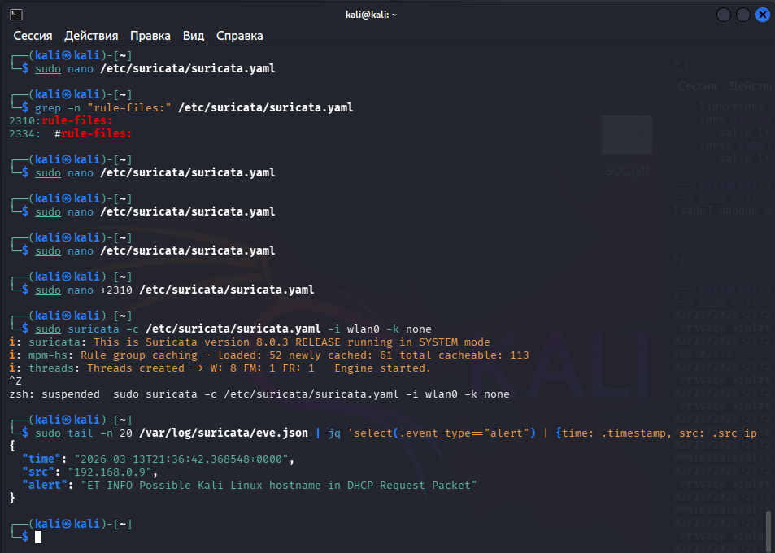
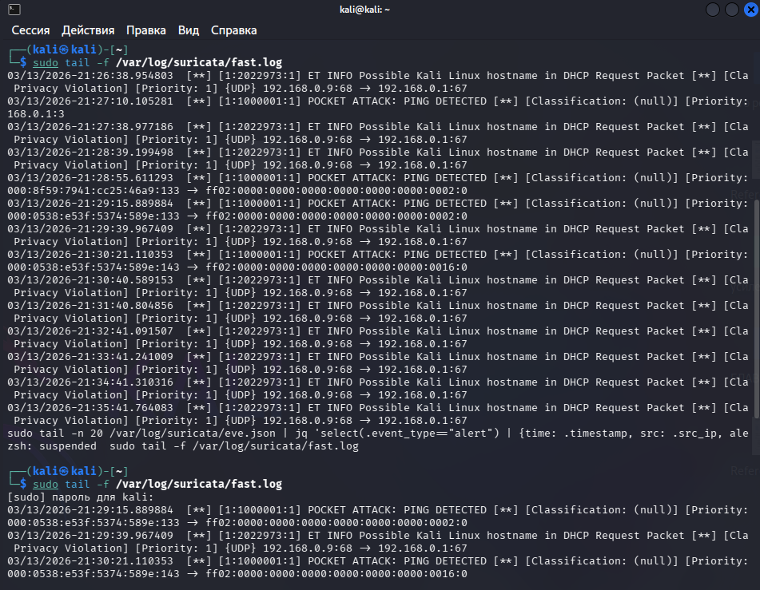

# 🕵️‍♂️ Case 18: Investigating Network Anomalies using Suricata IDS 🛡️

## 🛡️ Project Overview
In this lab, I performed the deployment and configuration of **Suricata** — a high-performance Network Intrusion Detection and Prevention System (IDS/IPS). The primary objective was to configure the engine for real-time monitoring on a specific network interface, analyze incoming traffic for anomalies, and interpret the generated security events.

## 💡 Lab Objectives
* Configure the `suricata.yaml` file and verify rule-set paths.
* Execute Suricata in IDS mode on a live network interface (`wlan0`).
* Analyze security events through `fast.log` and structured `eve.json` output.
* Identify suspicious activity (network reconnaissance, specific OS presence in the network).

## 🏗️ Tech Stack & Tools
* **IDS:** Suricata 8.0.3
* **OS:** Kali Linux
* **Analysis Tools:** `jq` (JSON parsing), `grep`, `tail`
* **Traffic Source:** Live network traffic (interface: `wlan0`)

---

## 🚀 Investigation Details & Technical Analysis

### 1. Configuration & Engine Initialization
The first phase involved validating the configuration. Using `grep`, I verified that the `rule-files` paths were correctly defined before initializing the engine.

* **Execution Command:** `sudo suricata -c /etc/suricata/suricata.yaml -i wlan0 -k none`
* **Observation:** The engine successfully initialized 8 processing threads and loaded 52 rule groups.


*Figure 1: Configuration check and successful Suricata IDS startup.*

### 2. Alert Analysis & Traffic Monitoring
Once active, the system began flagging suspicious activity. For rapid analysis, I monitored the `fast.log` (summary) and `eve.json` (detailed) files.

**Key Findings:**
* **ET INFO Possible Kali Linux hostname in DHCP Request:** Detection of a specific hostname in DHCP requests. This is a critical indicator for a SOC Analyst, as it reveals the presence of penetration testing tools within the network segment.
* **POCKET ATTACK: PING DETECTED:** Registration of ICMP traffic, which may indicate reconnaissance (network scanning) by a potential threat actor.


*Figure 2: Real-time analysis of fast.log and alert filtering.*

### 3. Deep Dive with JSON Parsing
To extract granular data (source IPs, microsecond timestamps), I parsed the `eve.json` file using the `jq` utility.

```bash
sudo tail -n 20 /var/log/suricata/eve.json | jq 'select(.event_type=="alert") | {time: .timestamp, src: .src_ip, alert: .alert.signature}'
