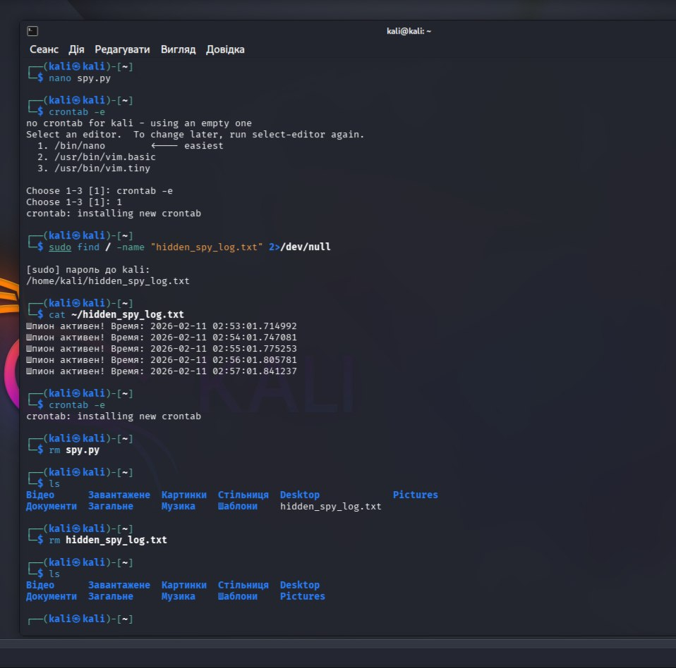

Lab: Persistence Mechanisms via Linux Crontab

Objective
To demonstrate how an attacker can maintain persistence on a Linux system using the `cron` scheduling utility. This lab simulates a script that automatically executes at regular intervals without user intervention.

Methodology
1. Creation: Developed a Python script (`spy.py`) that logs activity to a hidden file, simulating data exfiltration or heartbeat signals.
2. Scheduling: Used the `crontab -e` command to schedule the script to run every minute:
   `* * * * * python3 /home/kali/spy.py`
3. Verification: Monitored the `hidden_spy_log.txt` file to confirm successful execution by the system daemon.

Evidence
> [!IMPORTANT]
> Below is the terminal output showing the crontab entry and the resulting log file.

SOC Analyst Perspective
Detection: Analysts should regularly audit user crontabs using `crontab -l` or monitor `/var/spool/cron/` and `/etc/crontab`.
Behavioral Analysis:** Frequent, automated connections or file writes (Beaconing) are high-fidelity indicators of scheduled persistence.
Remediation: Remove the unauthorized crontab entry and delete the source script.
