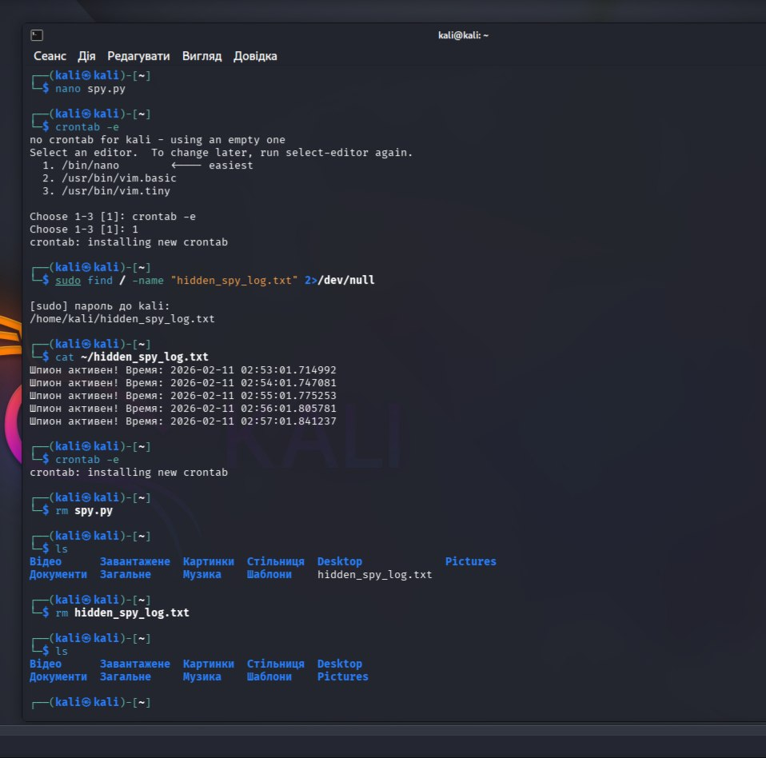

# 🕒 Linux Persistence: Crontab Manipulation

## 🎯 Project Objective
This laboratory work demonstrates how an attacker can maintain long-term access (Persistence) to a Linux system by abusing the `cron` scheduling utility. The goal is to simulate a malicious script that executes automatically at regular intervals without user intervention.

---

## 🛠️ Environment & Tools
| Component | Details |
| :--- | :--- |
| **OS** | 🐧 Kali Linux |
| **Language** | 🐍 Python |
| **System Tool** | ⏱️ Cron (Job Scheduler) |
| **Artifacts** | `spy.py` (Script), `hidden_spy_log.txt` (Log) |

---

## 🚀 Methodology & Execution

### 1. 📂 Malicious Script Creation
I developed a Python script named `spy.py`. This script mimics "heartbeat" signals or data exfiltration by logging timestamps to a hidden file.
* **Function:** Logs activity status every time it is triggered.

### 2. ⚙️ Persistence Mechanism
To ensure the script runs every minute, I modified the user's crontab using the `crontab -e` command.
* **Cron Expression:** `* * * * * python3 /home/kali/spy.py`
* **Impact:** This ensures that even if the system reboots or the current session ends, the malicious activity will resume automatically.

### 3. ✅ Execution Verification
I monitored the `hidden_spy_log.txt` file to confirm that the system daemon was successfully triggering the script every 60 seconds.

---

## 📊 Evidence & Analysis

> [!IMPORTANT]
> **Observation:** The terminal output confirms the successful installation of the new crontab and the subsequent generation of logs with precise 1-minute intervals.

### Terminal Output Tracking:

---

## 🛡️ SOC Analyst Perspective: Detection & Defense

### 🔍 Detection Strategy
1.  **File System Auditing:** Regularly audit user crontabs using `crontab -l -u [username]` or by monitoring `/var/spool/cron/`.
2.  **Log Analysis:** Look for frequent, automated connections or file writes (Beaconing) which are high-fidelity indicators of scheduled persistence.
3.  **SIEM Monitoring:** Monitor for execution of `crontab -e` by non-admin users.

### 🛠️ Remediation
* Remove the unauthorized crontab entry.
* Identify and delete the source script (`spy.py`).
* Investigate the initial access vector that allowed the attacker to modify the crontab.

---
**Status:** 🟢 Completed | **Focus:** Persistence Mechanisms
