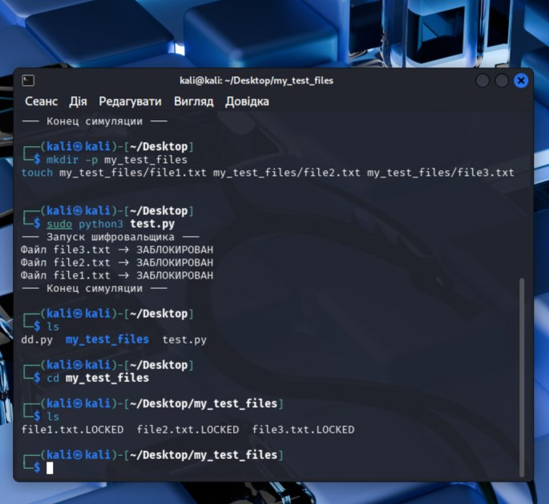

# ☣️ Ransomware Simulation & Behavioral Analysis

## 🎯 Project Objective
The goal of this laboratory work is to simulate a ransomware attack in a controlled environment to analyze how malicious scripts interact with the Linux file system, specifically focusing on unauthorized file encryption and extension renaming.

---

## 🛠️ Environment & Tools
| Component | Details |
| :--- | :--- |
| **OS** | 🐧 Kali Linux |
| **Script** | 🐍 `ransom_sim.py` (Python-based encryption simulator) |
| **Target Directory** | `./my_test_files/` |
| **Tools Used** | `ls`, `cd`, `python3`, `mkdir` |

---

## 🚀 Execution Process

### 1. Preparatory Phase
First, I created a dedicated directory and populated it with dummy documents to simulate a real-world user environment.
* **Command:** `mkdir my_test_files && touch my_test_files/file1.txt ...`

### 2. Attack Simulation
I executed the simulation script with elevated privileges to mimic a high-impact ransomware strain.
* **Action:** Running the `test.py` script.
* **Behavior:** The script recursively scanned the target directory and applied a simulated encryption algorithm.

### 3. Impact Analysis
Post-execution, I verified the integrity of the files. All original documents were successfully renamed and had their extensions changed to `.LOCKED`, making them inaccessible to the user.

---

## 📊 Results & Evidence

> [!IMPORTANT]
> **Observation:** The simulation successfully renamed all 3 target files within milliseconds. In a real-world SOC scenario, this would be detected via **File Integrity Monitoring (FIM)** or high-frequency I/O alerts.

### Terminal Output Tracking:
 

---

## 🛡️ SOC Perspective: Mitigation & Detection
To defend against this type of activity, the following measures should be implemented:
1.  **EDR Alerts:** Configure alerts for mass file renaming events (e.g., more than 10 files in 1 minute).
2.  **Backup Integrity:** Maintain offline, immutable backups to recover data without paying the ransom.
3.  **Permissions:** Implement the Principle of Least Privilege (PoLP) to restrict script execution in user directories.

---
**Status:** 🟢 Completed | **Focus:** Threat Simulation
