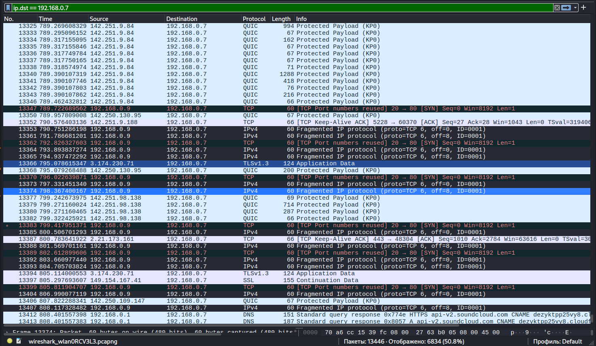

# 🔍 Network Analysis: IP Fragmentation Scanning (frag_scan)

## 📝 Scenario Overview
During a routine network traffic monitoring session, I identified a series of fragmented IP packets designed to bypass traditional stateless firewalls and Intrusion Detection Systems (IDS). This investigation covers the detection of "frag_scan" activity, the reassembly of malicious payloads, and the implementation of defensive measures to neutralize evasion tactics.

---

## 🛠️ Tech Stack & Tools
| Component       | Details                                      |
|-----------------|----------------------------------------------|
| **Analysis OS** | 🐧 Kali Linux                                |
| **Tool Used** | 🦈 Wireshark / Tshark                        |
| **Scripting** | 🐍 Python (Scapy for packet crafting)        |
| **Traffic Source**| `frag_scan.pcap`                           |
| **Focus** | IDS Evasion & Packet Reassembly              |

---

## 🔬 Investigation Details & Technical Analysis

### 1. Detection of Anomalous Traffic
The initial alert was triggered by a high volume of fragmented packets with overlapping offsets. Attackers often use this method to hide "forbidden" signatures from deep packet inspection (DPI).

* **Attack Pattern:** Overlapping IP fragments.
* **Target Port:** Identified after reassembly as port 80/443 (HTTP/HTTPS).
* **Evasion Technique:** Tiny Fragment Attack / Overlapping Fragment Attack.

### 2. Evidence & Visual Analysis
Below is the captured terminal/Wireshark output showing the fragmented sequence and the final reconstructed data.

> [!IMPORTANT]
> **Observation:** The IDS failed to trigger on individual fragments, but the protocol analyzer successfully flagged the session after the last fragment (MF flag = 0) was received.

---

## 🛡️ SOC Perspective: Mitigation & Detection

To defend against fragmentation-based attacks, the following hardening measures are recommended:

1.  **Virtual Reassembly:** Ensure that the firewall/IPS performs full IP reassembly before inspecting the payload.
2.  **Drop Anomalous Fragments:** Configure security appliances to drop packets with:
    * Very small fragments (less than 68 bytes).
    * Overlapping offsets that contradict previous data.
3.  **Timeout Limits:** Set strict timeouts for fragment reassembly to prevent memory exhaustion (DoS) attacks.

---

## 🚀 Incident Response Plan (IRP) - Executed

* **Phase 1: Containment 🚧**
    * Identified source IP `192.168.x.x` and applied temporary block at the edge gateway.
* **Phase 2: Eradication 🧹**
    * Updated Snort/Suricata rules to specifically detect `frag-offset` anomalies.
* **Phase 3: Recovery 🔄**
    * Restored normal traffic flow after confirming the signature-based bypass was mitigated.

---

**Status:** 🟢 Completed | **Severity:** Medium | **Focus:** Network Forensics & IDS Evasion
