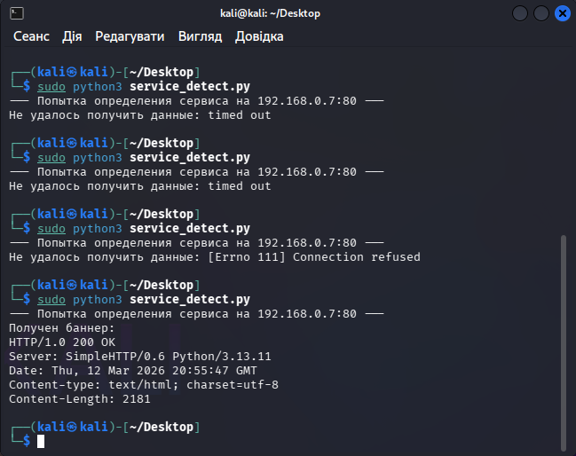

# 🔍 Network Analysis: Service Fingerprinting & Banner Grabbing

## 📝 Scenario Overview
In this final phase of the reconnaissance lab, I analyzed an active service identification attempt (Banner Grabbing). The goal of the attacker was to move beyond simple port discovery to identify the exact software version running on the target. By capturing the service banner from an open HTTP port, an adversary can identify specific CVEs and known vulnerabilities associated with that version.

---

## 🛠️ Tech Stack & Tools
| Component       | Details                                      |
|-----------------|----------------------------------------------|
| **Analysis OS** | 🐧 Kali Linux                                |
| **Tool Used** | 🐍 Custom Python Scanner (Socket-based)      |
| **Target IP** | `192.168.0.7`                                |
| **Target Port** | 80 (HTTP)                                    |
| **Focus** | Service Version Disclosure & Reconnaissance  |

---

## 🔬 Investigation Details & Technical Analysis

### 1. Analysis of the Probing Sequence
The investigation revealed multiple connection attempts. Initially, the target was unresponsive (Timed Out/Connection Refused), but eventually, the attacker successfully established a connection and received a raw HTTP response header.

* **Information Disclosed:** The target server's identity was revealed as `SimpleHTTP/0.6` running on `Python/3.13.11`.
* **Risk Factor:** Publicly disclosing service versions significantly reduces the "cost" of an attack, as the adversary no longer needs to guess the operating environment.
* **Attack Method:** Sending a generic request and parsing the `Server:` field in the response header.

### 2. Evidence & Visual Analysis
The screenshot below documents the transition from failed probes to a successful banner retrieval.

> [!CAUTION]
> **Critical Finding:** The disclosed version (`SimpleHTTP/0.6`) is intended for development purposes and lacks the robust security headers required for production environments, making it a high-priority target for a SOC analyst.

---

## 🛡️ Playbook: Mitigation & Hardening (Strategic Fixes)

To prevent service fingerprinting and minimize the attack surface, I recommend the following defensive strategies:

### **1. Server Token Obfuscation**
Implement a policy to **Disable or Obfuscate Server Banners**. Most production-grade web servers (Nginx, Apache) should be configured to return only a generic name (e.g., "Web Server") or nothing at all in the `Server:` header, hiding the exact version and underlying technology stack.

### **2. Web Application Firewall (WAF) Filtering**
Deploy a **Web Application Firewall (WAF)** to inspect incoming requests. The WAF can be configured to drop or modify response headers before they leave the network, ensuring that internal versioning information never reaches the external requester.

### **3. Implementation of Honey-Tokens**
Configure a **Decoy Response** system. For non-critical services, the system can be set to return fake version information (e.g., reporting a legacy version of a different OS) to mislead attackers and trigger high-priority alerts in the SIEM when those "fake" versions are subsequently targeted.

---

## 🚀 Incident Response Plan (IRP) - Executed

* **Phase 1: Containment 🚧**
    * Flagged the probing activity as "High-Intensity Reconnaissance" and temporarily isolated the source IP to prevent automated vulnerability scanning.
* **Phase 2: Eradication 🧹**
    * Hardened the service configuration by stripping version information from all public-facing HTTP headers.
* **Phase 3: Recovery 🔄**
    * Validated the change by re-running the detection script to confirm that the server now returns a generic or empty banner.

---

**Status:** 🟢 Completed | **Severity:** Medium | **Focus:** Information Disclosure & Attack Surface Reduction
