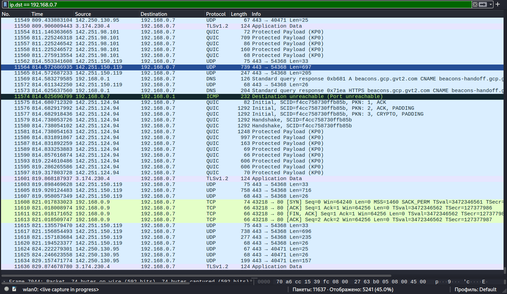

# 🔍 Network Analysis: TCP Connect Scan Detection (-sT)

## 📝 Scenario Overview
During proactive network monitoring, I detected a series of full TCP connection attempts targeting the web server (port 80). Unlike a "stealth" SYN scan, a TCP Connect scan completes the three-way handshake before closing the session. This investigation focuses on identifying the source of the reconnaissance and implementing architectural defenses to limit the attack surface.

---

## 🛠️ Tech Stack & Tools
| Component       | Details                                      |
|-----------------|----------------------------------------------|
| **Analysis OS** | 🐧 Kali Linux                                |
| **Tool Used** | 🦈 Wireshark / Nmap                          |
| **Source IP** | `192.168.0.9` (Attacker)                     |
| **Target IP** | `192.168.0.7` (Victim)                       |
| **Focus** | Reconnaissance Identification & Surface Hardening |

---

## 🔬 Investigation Details & Technical Analysis

### 1. Analysis of the Handshake Pattern
The traffic capture shows a textbook example of a TCP Connect scan. The source machine completes the full connection cycle to verify if the port is open and capable of accepting data.

* **Attack Pattern:** Sequence of `SYN` -> `SYN/ACK` -> `ACK` followed by an immediate `FIN/ACK` to close the connection.
* **Visibility:** High. Since the connection is fully established, it is recorded not only by the firewall but also in the application-layer logs (e.g., Apache/Nginx).
* **Target Port:** 80 (HTTP).

### 2. Evidence & Visual Analysis
The screenshot below illustrates the completed handshake between the attacker (`.9`) and the target (`.7`), confirming the port is open.

> [!IMPORTANT]
> **Observation:** The presence of the `ACK` packet (Frame 11610) after the `SYN/ACK` confirms that the scanner's OS kernel successfully established a session, distinguishing this from a half-open SYN scan.

---

## 🛡️ Playbook: Mitigation & Hardening (Strategic Fixes)

To mitigate the impact of active reconnaissance and TCP scanning, the following strategic measures are recommended:

### **1. Zero-Trust Access Control**
Implement a **Default-Deny Policy** at the network perimeter. Only explicitly required IP ranges or authenticated VPN users should be able to initiate connections to sensitive internal services. This prevents unauthorized "discovery" of the network topology.

### **2. Adaptive Port Blocking (IPS)**
Deploy an **Intrusion Prevention System (IPS)** configured with threshold-based rules. If a single source IP initiates connections to multiple ports within a short timeframe (Horizontal Scanning), the IPS should automatically trigger a temporary isolation of that IP.

### **3. Application-Level Logging & Monitoring**
Since TCP Connect scans leave traces in application logs, configure the **SIEM (Security Information and Event Management)** system to alert on "Empty Connections" — sessions that are established but closed immediately without sending any application data (GET/POST requests).

---

## 🚀 Incident Response Plan (IRP) - Executed

* **Phase 1: Containment 🚧**
    * Verified the intent of the scan. Since it originated from a non-authorized segment (`192.168.0.9`), the source was restricted at the core switch level.
* **Phase 2: Eradication 🧹**
    * Conducted a vulnerability scan on the target host (`192.168.0.7`) to ensure no other exploitable services were exposed during the reconnaissance phase.
* **Phase 3: Recovery 🔄**
    * Updated the local host-based firewall (HBF) policies to further restrict access to port 80 to legitimate load-balancer IPs only.

---

**Status:** 🟢 Completed | **Severity:** Low/Medium | **Focus:** Reconnaissance & Attack Surface Management
