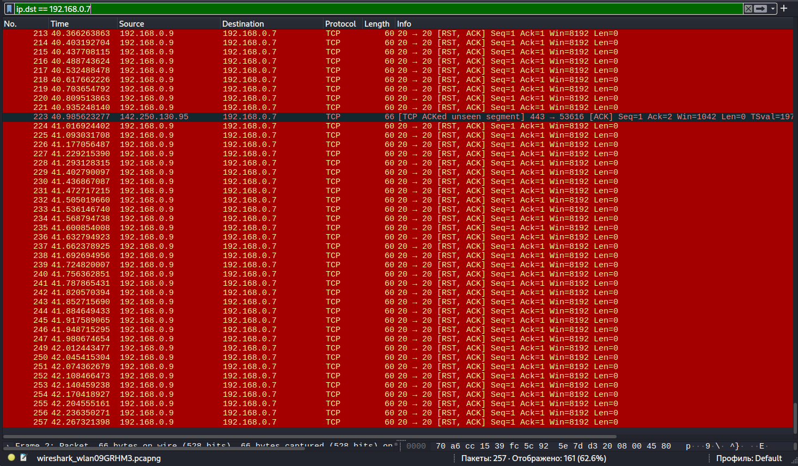

# ⚡ Network Analysis: TCP RST Flood (Connection Reset Attack)

## 📝 Scenario Overview
In this scenario, I investigated a targeted TCP RST (Reset) Flood attack. Unlike volumetric floods, this attack aims to disrupt communications by sending forged RST packets to a server, forcing it to abruptly terminate active connections. This lab demonstrates the analysis of TCP flag manipulation and the implementation of stateful inspection policies to maintain connection integrity.

---

## 🛠️ Tech Stack & Tools
| Component       | Details                                      |
|-----------------|----------------------------------------------|
| **Analysis OS** | 🐧 Kali Linux                                |
| **Tool Used** | 🦈 Wireshark                 |
| **Scripting** | 🐍 Python (Scapy for RST packet crafting)    |
| **Protocol** | TCP (Transmission Control Protocol)          |
| **Focus** | Session Disruption & State Exhaustion        |

---

## 🔬 Investigation Details & Technical Analysis

### 1. Identifying the Reset Storm
The investigation began after multiple users reported "Connection Reset by Peer" errors. Analyzing the packet capture revealed an abnormal ratio of RST packets compared to normal SYN/ACK traffic.

* **Attack Pattern:** High-frequency TCP packets with the `RST` flag set.
* **Observation:** The attacker attempted to guess active sequence numbers (SEQ) to inject RST packets into established streams.
* **Impact:** Immediate termination of legitimate user sessions and DoS for the application layer.

### 2. Evidence & Visual Analysis
The screenshot below shows the Wireshark capture where the red-highlighted rows indicate the massive injection of RST packets targeting active sessions.

> [!CAUTION]
> **Critical Finding:** A high volume of RST packets without a preceding SYN or ACK handshake is a high-fidelity indicator of a spoofed session termination attack.

---

## 🛡️ Playbook: Mitigation & Hardening (Strategic Fixes)

To defend against RST Flooding, the following security measures and policies should be implemented:

### **1. Stateful Packet Inspection (SPI)**
Enable and enforce **Stateful Inspection** on the perimeter firewalls. The security appliance must track the state of every TCP connection and automatically discard any RST packet that does not correspond to an established session in the local state table.

### **2. TCP Sequence Number Validation**
Configure Intrusion Prevention Systems (IPS) to perform **Strict Sequence Number Checking**. This ensures that even if an RST packet matches an IP/Port pair, it will be dropped if the Sequence Number falls outside the expected valid window of the current session.

### **3. Flag-Based Rate Limiting**
Implement a **Threshold Policy** on network devices to limit the maximum number of RST packets allowed from a single source IP per second. Any traffic exceeding this baseline should be automatically throttled or dropped to prevent resource exhaustion.

---

## 🚀 Incident Response Plan (IRP) - Executed

* **Phase 1: Containment 🚧**
    * Identified the source IP(s) generating anomalous RST traffic and applied a temporary block at the network perimeter.
* **Phase 2: Eradication 🧹**
    * Verified that no internal systems were compromised or acting as a proxy for the attack.
* **Phase 3: Recovery 🔄**
    * Monitored the "TCP Connection Reset" metric in the SIEM/Monitoring tool to ensure it returned to baseline levels (<1%).

---

**Status:** 🟢 Completed | **Severity:** High | **Focus:** TCP State Manipulation & Session Security
