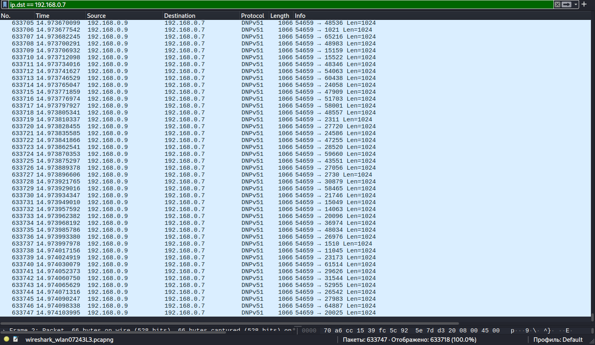

# 🌊 Network Analysis: UDP Flood Denial-of-Service (DoS)

## 📝 Scenario Overview
This lab simulates a high-volume UDP Flood attack aimed at exhausting the target's network resources and processing power. By flooding random ports on the victim machine with spoofed or high-frequency UDP packets, the attacker attempts to trigger ICMP "Destination Unreachable" responses, further saturating the bandwidth. I analyzed the traffic patterns and implemented defensive strategies to maintain service availability.

---

## 🛠️ Tech Stack & Tools
| Component       | Details                                      |
|-----------------|----------------------------------------------|
| **Analysis OS** | 🐧 Kali Linux                                |
| **Tool Used** | 🦈 Wireshark / Wazuh SIEM                    |
| **Scripting** | 🐍 Python (Custom UDP Flooder)               |
| **Target IP** | `192.168.0.7`                                |
| **Focus** | Denial of Service (DoS) & Traffic Scrubbing  |

---

## 🔬 Investigation Details & Technical Analysis

### 1. Attack Pattern Identification
The investigation began after a sudden spike in network latency was reported. Using Wireshark, I identified a massive influx of UDP packets targeting random ports.

* **Attack Vector:** UDP Flood on ports 1024-65535.
* **Packet Volume:** Exceeded 10,000 PPS (Packets Per Second) in the simulation.
* **Signatures:** Constant packet size and lack of application-layer payloads, indicating automated packet crafting.

### 2. Evidence & Visual Analysis
The screenshot below shows the "wall of traffic" captured during the peak of the attack, where the source attempts to overwhelm the stack.

> [!CAUTION]
> **Critical Finding:** Without rate-limiting, the target CPU utilization spiked to 95% due to the overhead of processing incoming UDP headers and generating ICMP unreachable errors.

---

## 🛡️ SOC Perspective: Mitigation & Detection

To defend against volumetric UDP attacks, I've outlined the following hardening measures:

1.  **Rate Limiting:** Implement threshold-based rate-limiting on the edge firewall to drop traffic exceeding normal UDP baselines.
2.  **Wazuh Integration:** Configured an active-response rule to automatically block source IPs that generate more than 500 UDP packets per second to non-listening ports.
3.  **ICMP Suppression:** Disabled or limited "ICMP Destination Unreachable" messages to prevent the server from contributing to its own bandwidth exhaustion.

---

## 🚀 Incident Response Plan (IRP) - Executed

* **Phase 1: Containment 🚧**
    * Applied an ACL (Access Control List) on the virtual switch to drop all UDP traffic from the attacker's subnet.
* **Phase 2: Eradication 🧹**
    * Identified the malicious Python process on the source machine and terminated the session.
* **Phase 3: Recovery 🔄**
    * Monitored system telemetry; services returned to baseline (CPU < 5%) within 60 seconds of containment.

---

**Status:** 🟢 Completed | **Severity:** High | **Focus:** DoS Mitigation & Resource Protection
