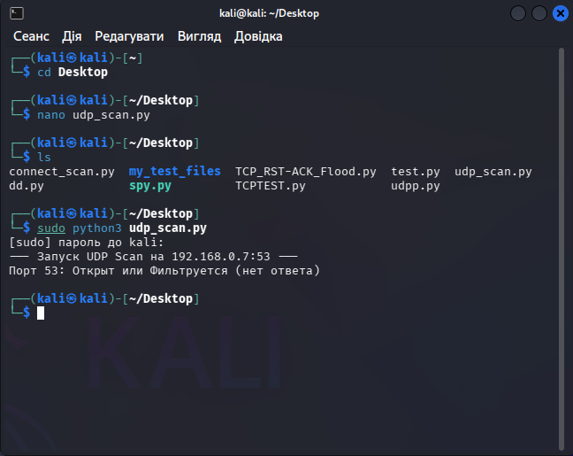
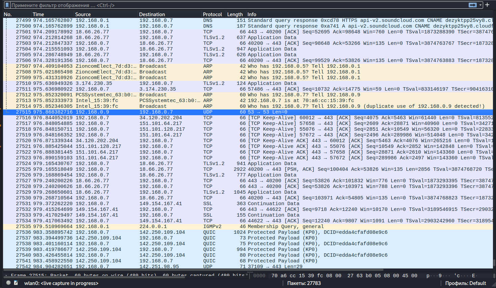

# 🔍 Network Analysis: UDP Port Scanning & Reconnaissance

## 📝 Scenario Overview
UDP scanning is inherently more complex than TCP due to the connectionless nature of the protocol. In this investigation, I analyzed a targeted UDP scan against critical service ports (specifically DNS/53). The goal was to identify open or filtered ports while observing how the network stack responds when no ICMP "Unreachable" messages are returned.

---

## 🛠️ Tech Stack & Tools
| Component       | Details                                      |
|-----------------|----------------------------------------------|
| **Analysis OS** | 🐧 Kali Linux                                |
| **Tool Used** | 🦈 Wireshark / Custom Python Scanner         |
| **Source IP** | `192.168.0.9` (Attacker)                     |
| **Target IP** | `192.168.0.7` (Victim)                       |
| **Focus** | Stateless Protocol Discovery & ICMP Analysis |

---

## 🔬 Investigation Details & Technical Analysis

### 1. Execution & Behavior
The attack was executed using a Python-based scanner targeting specific UDP ports. Unlike TCP, where a `SYN/ACK` clearly indicates an open port, UDP scanning relies on the *absence* of a response or a specific application-layer reply.

* **Scan Methodology:** Sending raw UDP packets to port 53.
* **Result Interpretation:** Since no ICMP "Destination Unreachable" was received from the target, the scanner flagged the port as `Open | Filtered`.

### 2. Evidence & Visual Analysis
Below is the terminal output showing the scanner's logic and the corresponding packet capture in Wireshark.

#### **A. Execution Log**
The custom script confirms the attempt to probe the target and the resulting "No Response" state.

#### **B. Packet-Level Capture**
In the Wireshark dump (Frame 27515), we can see the single UDP packet sent from `.9` to `.7` on port 53. The lack of any returning traffic is what triggers the "Open" status in the scanner.

> [!IMPORTANT]
> **Observation:** Attackers often target UDP services like DNS (53), SNMP (161), or NTP (123) because they are frequently overlooked by standard firewall rules and can be used for amplification attacks.

---

## 🛡️ Playbook: Mitigation & Hardening (Strategic Fixes)

To secure UDP services and limit reconnaissance capabilities, the following measures are recommended:

### **1. Explicit Service Filtering**
Implement a **Strict Egress/Ingress Policy** that drops all UDP traffic by default. Only permit specific, necessary ports (e.g., DNS) and only for authorized internal DNS forwarders.

### **2. ICMP Rate Limiting & Monitoring**
Configure network devices to **Rate Limit ICMP Type 3 (Destination Unreachable)** messages. While these messages help scanners identify closed ports, disabling them entirely can break network diagnostics. A balanced approach involves limiting the frequency of these responses to slow down automated scanners.

### **3. UDP Protocol Inspection**
Deploy **Deep Packet Inspection (DPI)**. Modern firewalls should be configured to check if the UDP payload actually matches the protocol intended for that port. A simple UDP "ping" to port 53 should be dropped if it doesn't contain a valid DNS query structure.

---

## 🚀 Incident Response Plan (IRP) - Executed

* **Phase 1: Containment 🚧**
    * Monitored the source IP `192.168.0.9` for further horizontal scanning. Applied a temporary quarantine policy in the NAC (Network Access Control).
* **Phase 2: Eradication 🧹**
    * Audited the target machine (`192.168.0.7`) to confirm that port 53 was only listening for authorized requests and was not vulnerable to DNS spoofing or reflection.
* **Phase 3: Recovery 🔄**
    * Adjusted the SIEM thresholds to alert on "Unsolicited UDP Probes" targeting non-public services.

---

**Status:** 🟢 Completed | **Severity:** Medium | **Focus:** Reconnaissance & Protocol Hardening
